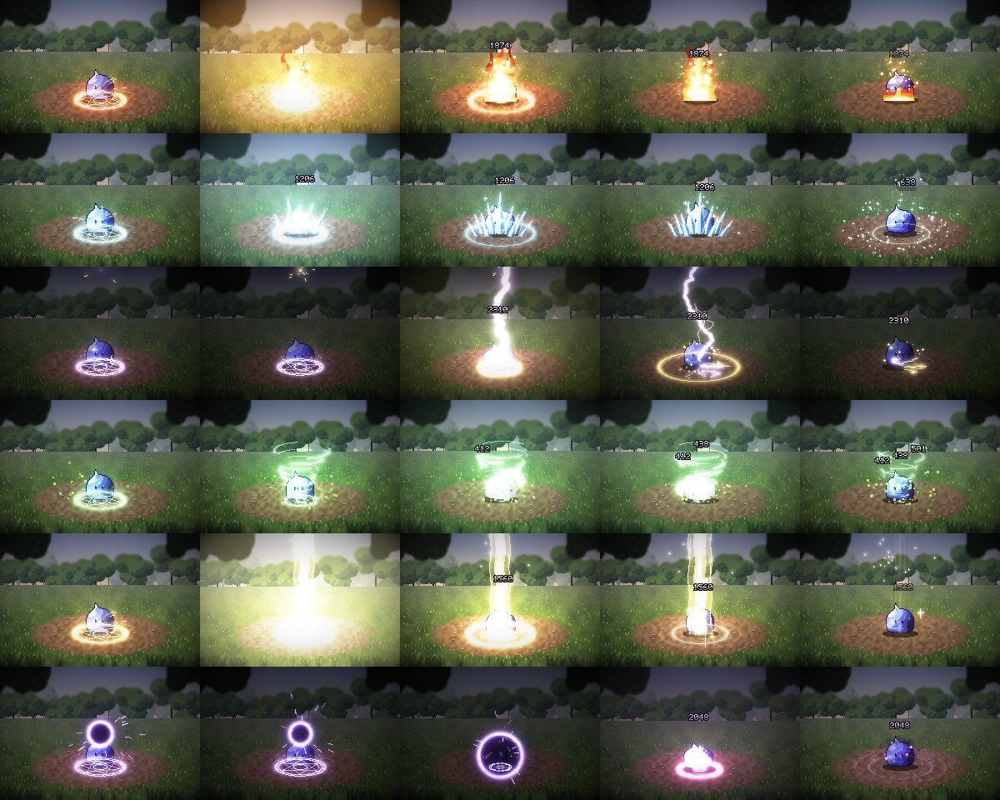

# spellfx: HD-2D spell GIF generator

Renders Octopath Traveler–style spell animations to GIF. Everything is procedural (no assets),
original, and follows the rules in [`docs/ART_STYLE.md`](../../docs/ART_STYLE.md).



| Spell | File | Element |
|---|---|---|
| Flame Pillar | `docs/art/spells/fire.gif` | Fire |
| Glacial Spikes | `docs/art/spells/ice.gif` | Ice |
| Thunderclap | `docs/art/spells/lightning.gif` | Lightning |
| Gale Vortex | `docs/art/spells/wind.gif` | Wind (3-hit) |
| Radiance | `docs/art/spells/light.gif` | Light |
| Umbral Collapse | `docs/art/spells/dark.gif` | Dark |

## Usage

```bash
pip install -r tools/spellfx/requirements.txt      # ffmpeg is optional but gives better GIFs
python tools/spellfx/make_gifs.py                   # all spells -> docs/art/spells/
python tools/spellfx/make_gifs.py fire ice --scale 2   # 480x320, smaller files
python tools/spellfx/make_gifs.py dark --seed 42    # different random variation
python tools/spellfx/make_gifs.py wind --no-bg      # on black: blend with "add"/"screen" in an engine
python tools/spellfx/make_gifs.py light --frames    # also dump a PNG sequence
```

## How the HD-2D look is produced

Each frame is rendered at two resolutions at once:

1. **Pixel layer (240×160)**: the forest diorama, the enemy sprite, rune circles, flame tongues,
   crystals, bolts and particles. It is upscaled with nearest neighbour, so pixels stay crisp.
2. **Soft layer**: glow deposits and bloom, blurred and upscaled smoothly. This is the
   "3D lighting on top of pixel art" part of HD-2D.

On top of that:

- **Scene lighting**: the backdrop is stored as unlit colour and multiplied by ambient light plus
  every spell light, so fire turns the clearing orange and lightning darkens the sky before it strikes.
- **Tilt-shift depth of field** on the tree line and foreground grass, plus a vignette.
- **Battle rhythm**: rune circle and gathering motes, then the element, then the impact
  (hit-stop, screen flash, shake, white sprite flash, star burst, bouncing damage number),
  then embers, mist or shards that linger.

## Adding a spell

Spells live in `spellfx/spells.py`. A spell is a function that schedules things on a `World` timeline:

```python
def my_spell(w):
    x, y = w.scene.target.x, w.scene.target.y
    magic_circle(w, x, y, 30, rgb('#ff7a2a'), .05, 1.2)        # anticipation
    w.shape(1.0, .8, lambda cv, k, age: cv.disc('add', x, y - 20, 10, 10, rgb('#ffffff'), 1 - k))
    w.during(1.0, 1.6, lambda w, k: w.part(x=x, y=y, vy=-60, life=.5, cols=FIRE))
    w.light(x, y - 20, 90, rgb('#ff7a2a'), 2.0, 1.0, 1.2)
    hit(w, 1.05, x, y - 16, '#ff9a40', 999)                    # impact beat
```

Register it in `SPELLS` at the bottom of the file with a display name and duration.

Building blocks: `magic_circle`, `gather`, `shockwave`, `burst_star`, `sparks`, `hit`. Canvas
primitives: `px`, `rect`, `line`, `polyline`, `ring`, `disc`, `poly`, on the layers `add` (crisp
additive), `glow` (soft light), `normal` (opaque pixels, smoke), `dark` (void) and `ui`.
